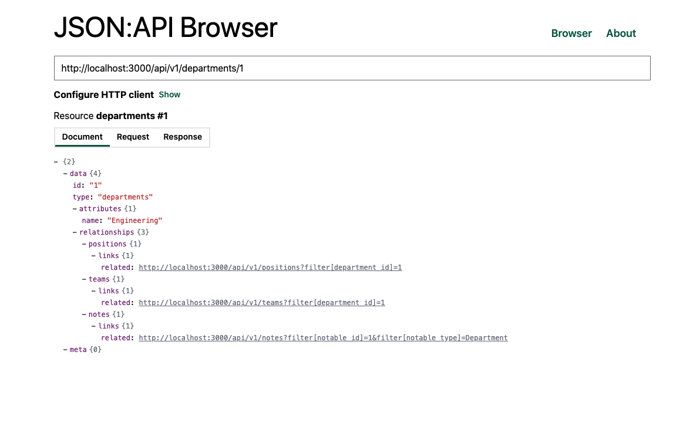

# JSON:API Browser

Browser for web API implementing [JSON:API v1.0](https://jsonapi.org/).

**Stack**

- [TypeScript](https://www.typescriptlang.org/)
- [Vue.js 3](https://vuejs.org/)
- [Vite](https://vitejs.dev/)
- [WindiCSS](https://windicss.org/)
- [jsonapi-metal-client](https://github.com/masterT/jsonapi-metal-client)

## Demo

[https://masterT.github.io/jsonapi-browser](https://masterT.github.io/jsonapi-browser)



## Development

Requirements:

- Yarn
- Node.js

### Project Setup

Install dependencies:

```shell
yarn install
```

### Compiles and hot-reloads for development

```shell
yarn run dev
```

### Build

Build the application:

```shell
yarn run build
```

Then run the preview server:

```shell
yarn run preview
```

## Deployment

Deploy on [GitHub pages](https://pages.github.com/):

```shell
./deploy.sh
```

## License

[MIT](./LICENSE)
